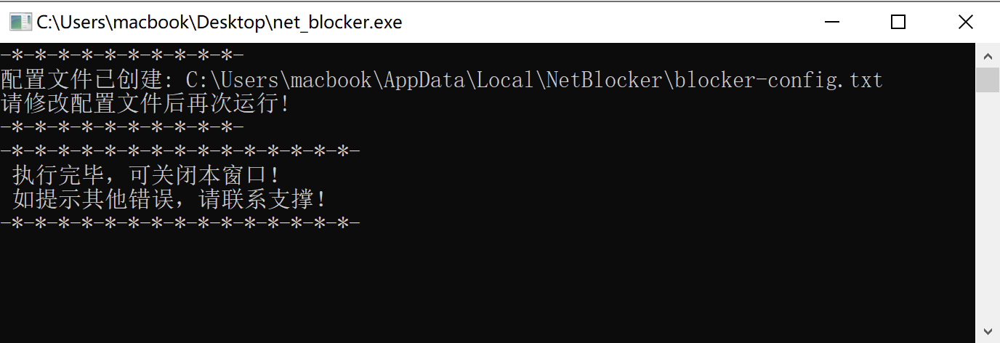
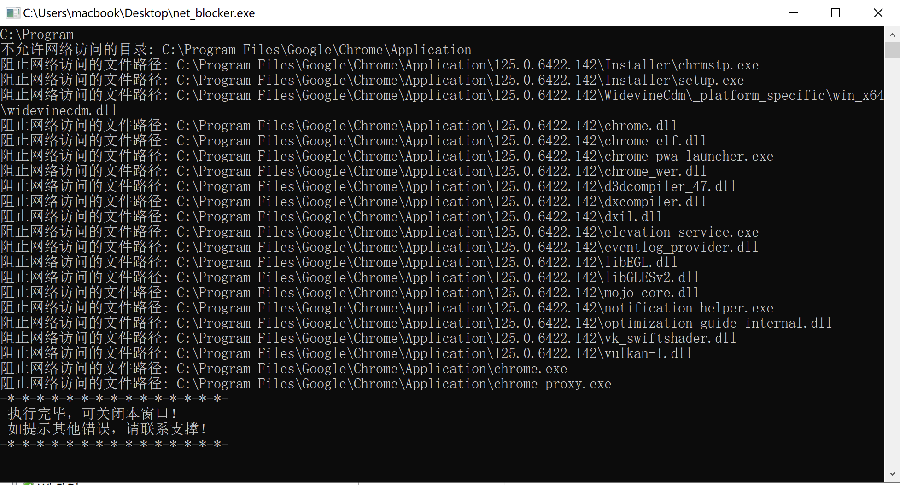

# 禁止某目录下所有可执行文件联网

## 一、程序任意放置在某目录。

程序名称：net_blocker.exe

## 二、程序执行

请右键以管理权限执行。

1. 第一次执行会创建配置文件，并提示配置文件的位置。
    
    
    
2. 打开配置文件，按提示添加禁止/允许联网的文件夹目录。
    
    ```bash
    # 允许网络访问的目录路径，每行一个路径
    # [allow] /path/to/allowed_directory1
    # [allow] /path/to/allowed_directory2
    
    # 不允许网络访问的目录路径，每行一个路径
    # [deny] /path/to/blocked_directory1
    # [deny] /path/to/blocked_directory2
    
    # 正式生效的目录配置，需要将开头的符号 # 去掉。
    # 我以禁止Chrome浏览器联网为例。
    [deny] C:\Program Files\Google\Chrome\Application
    ```
    
3. 再次运行程序。
    
    
    
4. 执行完毕，可关闭。